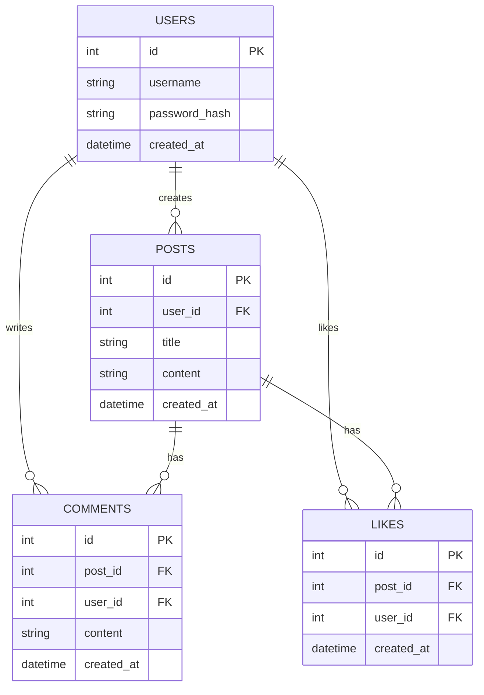

# Blog API

This is a **RESTful API** for a blogging platform, featuring user authentication, posts, comments, and likes.

## Live docs

Check out the swagger docs here:
https://blog-api-1i1j.onrender.com/docs

Or if you prefer a good UI (build with ReactJS and WebTUI):
https://majestic-croquembouche-a1c89c.netlify.app/

You can log in using the test credentials:

- **Username**: `testuser`  
- **Password**: `password123`

Or create a new user.

## Features

- **JWT Authentication**  -   Register and log in using jwt tokens
- **Protected Routes**    -   Access posts, comments, and likes only with a valid jwt token
- **Comments & Likes**    -   Like/Unlike and post comments under a specific posts
- **Caching**             -   Caching using Redis for reduced latency

## Tech Stack

- **Python** / **FastAPI**  
- **PostgreSQL**  
- **Docker**
- **Redis**
- **JWT Auth**

## ER Diagram

## Routes Table
**Auth Routes**

| Method | Endpoint         | Handler         | Description                     |
| ------ | -----------------| --------------- | ------------------------------- |
| POST   | `/auth/register` | `register`      | Create a new user account       |
| POST   | `/auth/login`    | `login`         | Login user and return JWT token |
| GET    | `/auth/users/me` | `read_users_me` | Get the current logged in user  |

**Posts Routes**

| Method | Endpoint          | Handler        | Description                                         |
| ------ | ----------------- | -------------- | --------------------------------------------------- |
| GET    | `/posts/`         | `get_posts`    | Get all posts (cached)                              |
| GET    | `/posts/my-posts` | `get_my_posts` | Get posts created by the current logged in user     |
| GET    | `/posts/{id}`     | `get_post`     | Get a single post by ID                             |
| POST   | `/posts/`         | `create_posts` | Create a new post                                   |
| PUT    | `/posts/{id}`     | `update_posts` | Update an existing post                             |
| DELETE | `/posts/{id}`     | `delete_posts` | Delete a post                                       |

**Comments Routes**

| Method | Endpoint                                 | Handler                 | Description                               |
| ------ | ---------------------------------------- | ----------------------- | ----------------------------------------- |
| GET    | `/comments`                              | `get_comments`          | Get all comments                          |
| GET    | `/posts/{post_id}/comments`              | `get_comments_for_post` | Get all comments for a specific post      |
| POST   | `/posts/{post_id}/comments`              | `create_comment`        | Create a new comment on a post            |
| PUT    | `/posts/{post_id}/comments/{comment_id}` | `update_comment`        | Update a specific comment                 |
| DELETE | `/posts/{post_id}/comments/{comment_id}` | `delete_comment`        | Delete a specific comment                 |

**Likes Routes**

| Method | Endpoint                | Handler       | Description                  |
| ------ | ----------------------- | ------------- | ---------------------------- |
| POST   | `/posts/{post_id}/like` | `like_post`   | Like a post                  |
| DELETE | `/posts/{post_id}/like` | `unlike_post` | Unlike a post or remove like |

## Areas of improvement

**Better Separation of Concerns**: The project currently follows a straightforward directory structure where handlers, business logic, and the database layer are tightly coupled. A more scalable approach would be to introduce service classes like PostService, CommentService, etc, with clear responsibilities. Then, each handler would delegate the work to these services.

**Dependency Injection**: Each of these services would also be injected with the required dependencies, like the databse, auth, etc

**Graceful Shutdown**: I would also add graceful shutdowns. Currently, when the server is terminated, it shuts down immediately, which can lead to a poor user experience, as some users may not have completed their requests. A graceful shutdown process that stops accepting new requests and allows in-progress requests to finish before shutting down would a good improvement.